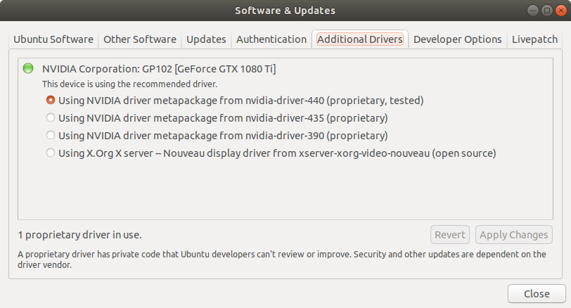
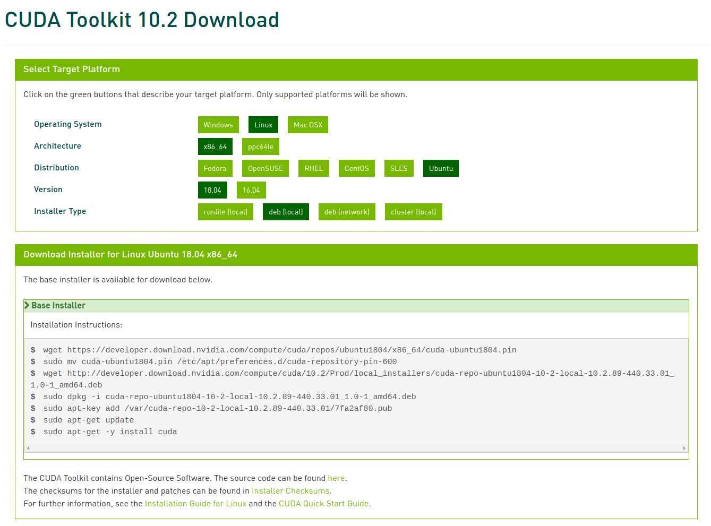
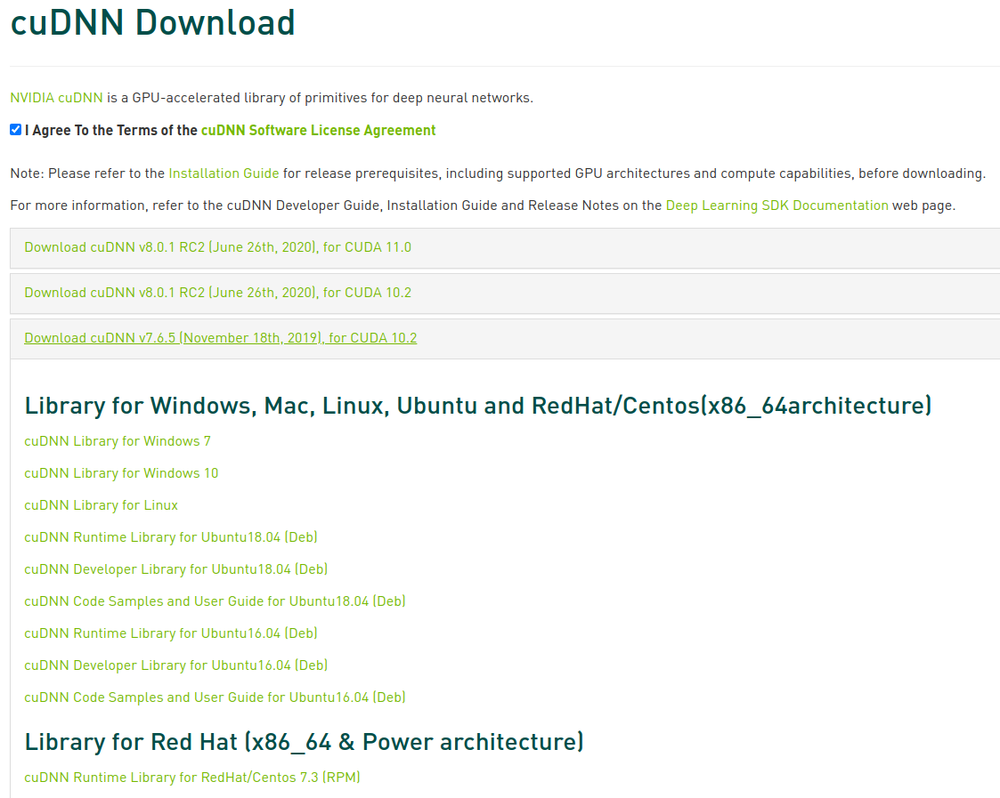
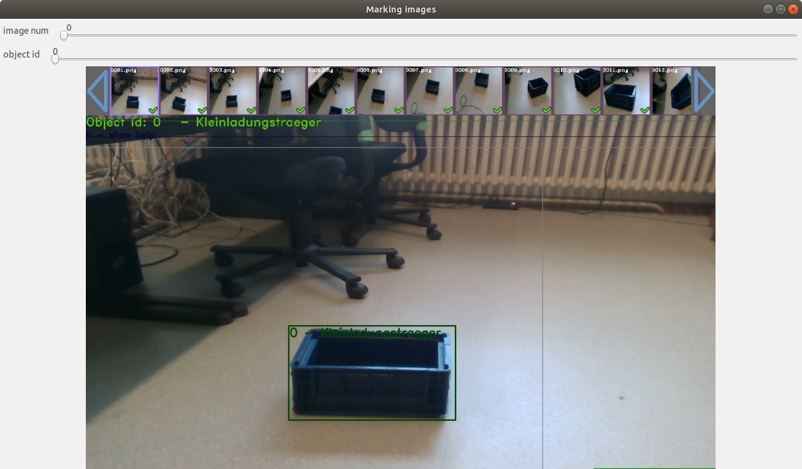
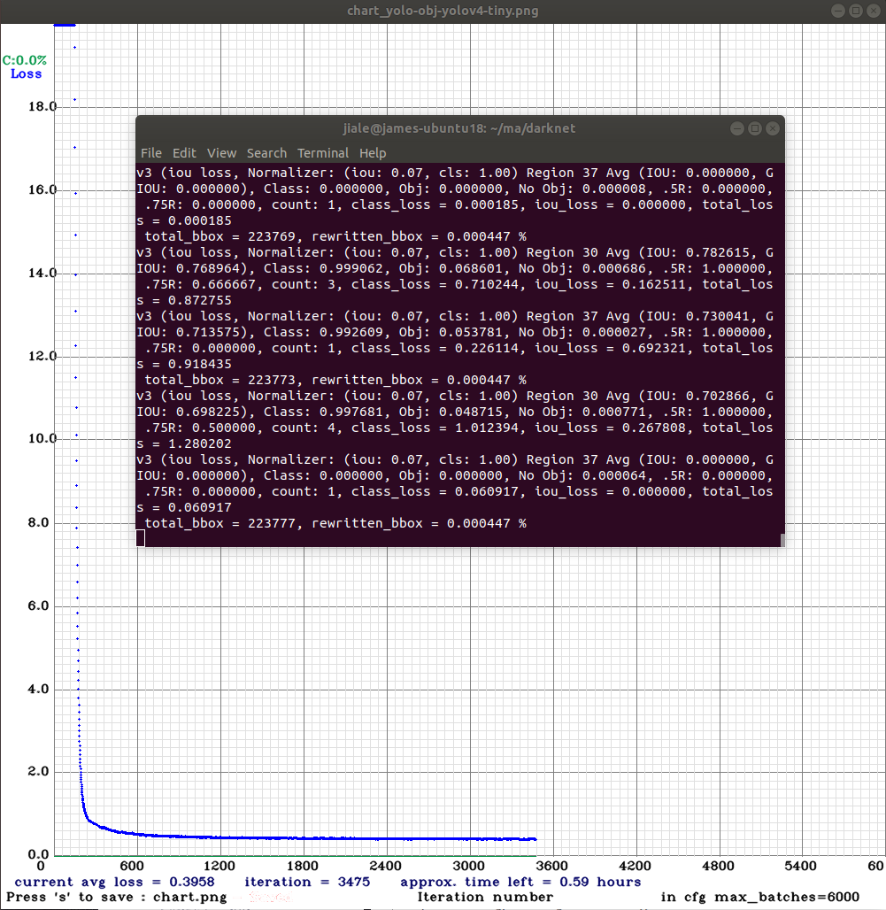

# Train custom data set based on darknet
The custom data set being trained consists of two categories, they are Kleinladungsträger and people. The data set of Kleinladungsträger consists of 642 photos taken by ourselves. The data set of people consists of nealy 10000 photos from the famous data set VOC2012.

1. [Prerequisite](#Prerequisite)
2. [Preparation](#Preparation)
3. [Make labels for the data set of Kleinladungsträger](#jump4)
4. [Extract the photos and labels of the data set of people and copy two data sets of Kleinladungsträger and people into darknet directory](#jump5)
5. [Training](#Training)
6. [Test](#Test)

## Prerequisite
- Ubuntu 18.04
- GTX 1080Ti
- [Nvidia Driver >= 440](#jump1)
- [Cuda >= 10.2](#jump2): [https://developer.nvidia.com/cuda-toolkit-archive](https://developer.nvidia.com/cuda-toolkit-archive) 

    After Installation:
    ```bash
    $ echo 'export PATH=/usr/local/cuda/bin${PATH:+:${PATH}}' >> ~/.bashrc && echo 'export LD_LIBRARY_PATH=/usr/local/cuda/lib64' >> ~/.bashrc && echo 'export LD_LIBRARY_PATH=/usr/local/cuda/include:$LD_LIBRARY_PATH' >> ~/.bashrc && source ~/.bashrc
    ```
- [cuDNN >= 7.6.5](#jump3): [https://developer.nvidia.com/rdp/cudnn-download](https://developer.nvidia.com/rdp/cudnn-download)
- CMake >= 3.18.0: 
    ```bash
    $ sudo apt purge cmake 
    $ sudo snap install cmake --classic
    $ hash –r  
    ```
- OpenCV >= 3.2: `$ sudo apt install libopencv-dev`

#### <span id="jump1">Install Nvidia Driver</span>


#### <span id="jump2">Install Cuda</span>


#### <span id="jump3">Install cuDNN</span>

1. Download:
    - cuDNN Runtime Library for Ubuntu16.04 (Deb)
    - cuDNN Developer Library for Ubuntu16.04 (Deb)
2. Go to downloads folder, for example "Downloads"
    ```bash
    $ cd ~/Downloads
    ```
3. Install the .deb packages
    ```bash
    $ sudo dpkg -i libcudnn7_7.6.5.32-1+cuda10.2_amd64.deb
    $ sudo dpkg -i libcudnn7-dev_7.6.5.32-1+cuda10.2_amd64.deb 
    ```
4. Reload bash
    ```bash
    $ source ~/.bashrc
    ```

## Preparation
#### Download this repository
```bash
$ cd ~ && mkdir train_custom_data && cd train_custom_data 
$ git clone https://github.com/jameslele/darknet-yolo.git
```

#### Download Darknet and compile
```bash
$ cd ~/train_custom_data/darknet-yolo
$ git clone https://github.com/AlexeyAB/darknet.git
$ cd dakrnet
$ nano Makefile
...
GPU=1
CUDNN=1
OPENCV=1
...
$ make
```

#### Download Yolo_mark and compile
Yolo_mark is a Windows & Linux GUI for marking bounded boxes of objects in images for training Yolo and creating labels in txt file.
```bash
$ cd ~/train_custom_data/darknet-yolo
$ git clone https://github.com/AlexeyAB/Yolo_mark.git
$ cd Yolo_mark
$ cmake .
$ make
```

#### Download VOC2012 data set
```bash
$ cd ~/train_custom_data/darknet-yolo
$ wget http://host.robots.ox.ac.uk/pascal/VOC/voc2012/VOCtrainval_11-May-2012.tar
$ tar xvf VOCtrainval_11-May-2012.tar 
$ mv VOCdevkit/* ./ && rm -rf VOCdevkit/ VOCtrainval_11-May-2012.tar
```

## <span id="jump4">Make labels for the data set of Kleinladungsträger</span>
- delete all files from directory x64/Release/data/img in directory of Yolo_mark
    
    `$ rm ~/train_custom_data/darknet-yolo/Yolo_mark/x64/Release/data/img/*`
- put your .jpg-images or .png-images to this directory x64/Release/data/img
- change numer of classes (objects for detection) in file x64/Release/data/obj.data: https://github.com/AlexeyAB/Yolo_mark/blob/master/x64/Release/data/obj.data#L1
- put names of objects, one for each line in file x64/Release/data/obj.names: https://github.com/AlexeyAB/Yolo_mark/blob/master/x64/Release/data/obj.names
- run file: ./linux_mark.sh 
    ```bash
    $ cd ~/train_custom_data/darknet-yolo/Yolo_mark
    $ ./linux_mark.sh
    ```
    
 
The tagged data set of `Kleinladungsträger` has been uploaded to [FAU Box](https://faubox.rrze.uni-erlangen.de/folderstable) under `Studierende (Christian Hofmann)/Austausch/Yolo Gewicht`.

## <span id="jump5">Extract the photos and labels of the data set of people and copy two data sets of Kleinladungsträger and people into darknet directory</span>
```bash
$ cd ~/train_custom_data/darknet-yolo
$ python3 collect_data.py
```

## Training
[Training Yolo V4-Tiny](https://github.com/AlexeyAB/darknet#how-to-train-to-detect-your-custom-objects):
1. Downlaod [file with the first 29-convolutional layers of yolov4-tiny](https://github.com/AlexeyAB/darknet/releases/download/darknet_yolo_v4_pre/yolov4-tiny.conv.29)
    ```bash
   $ cd ~/train_custom_data/darknet-yolo/darknet
   $ wget https://github.com/AlexeyAB/darknet/releases/download/darknet_yolo_v4_pre/yolov4-tiny.conv.29
   ```
2. Create file `yolo-obj-yolov4-tiny.cfg` with the same content as in `yolov4-custom.cfg` (or copy `yolov4-custom.cfg` to `yolo-obj-yolov4-tiny.cfg)` and:

    - change line batch to [`batch=64`](https://github.com/AlexeyAB/darknet/blob/master/cfg/yolov4-tiny-custom.cfg#L6)
    
    - change line subdivisions to [`subdivisions=16`](https://github.com/AlexeyAB/darknet/blob/master/cfg/yolov4-tiny-custom.cfg#L7)
    
    - change line max_batches to (`classes*2000` but not less than number of training images, but not less than number of training images and not less than `6000`), f.e. [`max_batches=6000`](https://github.com/AlexeyAB/darknet/blob/master/cfg/yolov4-tiny-custom.cfg#L20) if you train for 3 classes
    
    - change line steps to 80% and 90% of max_batches, f.e. [`steps=4800,5400`](https://github.com/AlexeyAB/darknet/blob/master/cfg/yolov4-tiny-custom.cfg#L22)
    
    - set network size [`width=416 height=416`](https://github.com/AlexeyAB/darknet/blob/master/cfg/yolov4-tiny-custom.cfg#L8) or any value multiple of 32, e.g. 224
    
    - change line `classes=80` to your number of objects in each of 2 `[yolo]`-layers
    
    - change [`filters=255`] to filters=(classes + 5)x3 in the 2 `[convolutional]` before each `[yolo]` layer, keep in mind that it only has to be the last `[convolutional]` layers before each of the `[yolo]` layers 
    
        So if `classes=1` then should be `filters=18`. If `classes=2` then write `filters=21`.

3. Start training:
    The file `yolo-obj-yolov4-tiny.cfg` is stored in root directory of `darknet`.
    ```bash
   $ cd ~/train_custom_data/darknet-yolo/darknet
   $ ./darknet detector train data/obj.data yolo-obj-yolov4-tiny.cfg yolov4-tiny.conv.29 
   ```
   

The trained weight has been uploaded to [FAU Box](https://faubox.rrze.uni-erlangen.de/folderstable) under `Studierende (Christian Hofmann)/Austausch/Yolo Gewicht`.
## Test
The trained weight file is stored in the `backup` folder under darknet directory.

Change line subdivisions to [`subdivisions=1`](https://github.com/AlexeyAB/darknet/blob/master/cfg/yolov4-tiny-custom.cfg#L7) of the file `yolo-obj-yolov4-tiny.cfg`.
```bash
$ cd ~/train_custom_data/darknet-yolo/darknet

# test with a video
$ ./darknet detector demo data/obj.data yolo-obj-yolov4-tiny.cfg backup/yolo-obj-yolov4-tiny_final.weights -ext_output test.mp4

$ test with a camera
./darknet detector demo data/obj.data yolo-obj-yolov4-tiny.cfg backup/yolo-obj-yolov4-tiny_final.weights -c 0
```


